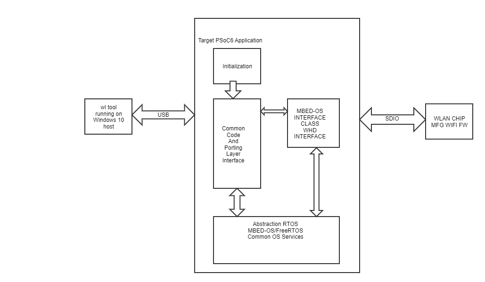

# PSoC 6 MCU: WLAN Manufacturing Test Application for mbed-os

The WLAN Manufacturing Test Application is used to validate the WLAN Firmware and Radio Performance of Wifi Chip.

The WLAN MFG Application acts as a transport layer between the host "wl tool" and WLAN Firmware. Mfg Test Application recieves commands from the wl tool and forwards them to the Wlan firmware using IOVAR/IOCTL commands. The Mfg Test App also relays the response received back from Wlan firmware.

The "wl tool" binaries for testing the WLAN Firmware are also included in this application repository. The example of using this application with wl tool is shown below.


## Requirements

- [Mbed OS toolchain](https://github.com/ARMmbed/mbed-cli-windows-installer/releases/tag/v0.4.10)
- Programming Language: C
- Supported Toolchains: Arm® GCC, ARM Compiler 6


## Dependent assets

- [Wifi Manufacturing Test Library](https://github.com/cypresssemiconductorco/wifi-mfg-test)

- [ARM mbed-os stack version 6.2.0 and above](https://os.mbed.com/mbed-os/releases)


## Validated Kits

- [PSoC 6 Wi-Fi BT Prototyping Kit](https://www.cypress.com/CY8CPROTO-062-4343W) (CY8CPROTO-062-4343W) - Default target
- [PSoC 62S2 Wi-Fi BT Pioneer Kit](https://www.cypress.com/CY8CKIT-062S2-43012) (CY8CKIT-062S2-43012)
- [PSoC 6 WiFi-BT Pioneer Kit](https://www.cypress.com/CY8CKIT-062-WIFI-BT) (CY8CKIT-062-WIFI-BT)
- [PSoC 62S1 WiFi-BT Pioneer Kit](https://www.cypress.com/CYW9P62S1-43438EVB-01) (CYW9P62S1-43438EVB-01)


## Hardware Setup

This application uses the board's default configuration. See the kit user guide to ensure that the board is configured correctly.

The application running on a PSoC 6 MCU kit and the test setup are shown below:



Note: The PSoC 6 BLE Pioneer Kit (CY8CKIT-062-BLE) and the PSoC 6 WiFi-BT Pioneer Kit (CY8CKIT-062-WIFI-BT) ship with KitProg2 installed. ModusToolbox software requires KitProg3. Before using this application, make sure that the board is upgraded to KitProg3. The tool and instructions are available in the Firmware Loader GitHub repository. If you do not upgrade, you will see an error like "unable to find CMSIS-DAP device" or "KitProg firmware is out of date".

This application uses the board's default configuration. See the kit user guide to ensure that the board is configured correctly.


## Software Setup

This application requires WL Tool running on a windows PC and uses UART port for communication with target. The pre-built executables for WL Tool are available in wl-tool-bin/ directory.


## Using the Application


### In Command-line Interface (CLI) on the build machine:


#### Check-out

```bash
$ # Get the workspace
$ git clone https://github.com/cypresssemiconductorco/mbed-os-wifi-mfg-tester
$ cd mbed-os-wifi-mfg-tester
$ mbed deploy -v
```

#### Building app

Put the Board in DAP link Mode by pressing SW3 button. The DAP link mode means a MASS Storage Drive should appear on your windows PC.

```bash
$ # Build and Download the "mfg-test" application
$ mbed compile -m `kit` -t GCC_ARM -f 
#example mbed compile -m CY8CPROTO_062_4343W -t GCC_ARM -f
```

## Operation

1. Go to wl tool directory using `cd ./mfg-test-wl-tool/bin`

2. Copy (wl`chiprev`.exe) into a seperate wl_tool directory on the Windows host.
              #example `wl4343x.exe` file into wl_tool directory.
			  
3. Goto the directory `wl_tool` on Windows host. 

4. Reset the Board by pressing SW1 button

5. Run the command on Windows Host
   wl4343x.exe --serial `port` ver
		#example wl4343x.exe --serial 139 ver

6. Observe the output of the command

7. List of WL commands which can be retrieved by typing --help
   #example wl4343Wx.exe --serial 139 --help

   Usage: wl4343x.exe [-a|i <adapter>] [-h] [-d|u|x] <command> [arguments]

		-h        this message and command descriptions
		-h [cmd]  command description for cmd
		-a, -i    adapter name or number
		-d        output format signed integer
		-u        output format unsigned integer
		-x        output format hexdecimal

		ver     get version information

		cmds    generate a short list of available commands

		ioctl_echo
			check ioctl functionality

		up      reinitialize and mark adapter up (operational)

		down    reset and mark adapter down (disabled)

		out     mark adapter down but do not reset hardware(disabled)
				On dualband cards, cards must be bandlocked before use.

		clk     set board clock state. return error for set_clk attempt if the driver is not down
				0: clock off
				1: clock on

		restart Restart driver.  Driver must already be down.

		reboot  Reboot platform

Note: For CYW4343W and CYW43438 based targets, please use the wl tool: wl4343X.exe
